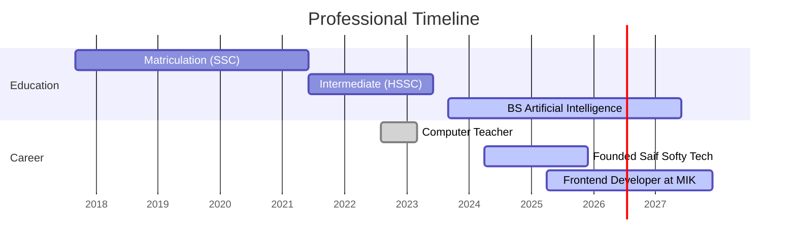

<!-- Animated Waving Header with Gradient -->

  

<!-- Typing Animation Intro -->

  

---
<!-- Visitor Counter -->

  

<!-- SEO-Optimized Header -->

  

    
    
    
  

---

## 🔬 **Technical Competencies**

| Artificial Intelligence           | Frontend Engineering         | Others        |
|-----------------------------------|------------------------------|-----------------------------|
|  |  |  |
|  |  |  |
|  |  |  |
|  |  |  |
|  |  |  |
| |  |  |
| |  |  |

---

## 📜 **Career Timeline**

### 📈 GitHub Analytics
<!-- Enhanced Stats Cards Layout -->

  

---

### 🏆 Achievements
<!-- Trophies with Custom Theme -->

  

---

### 📫 Let's Connect
<!-- Animated Social Badges -->

  
  
  
  

  
  
  
  
  

---

<!-- Dynamic Quote Footer -->

  

